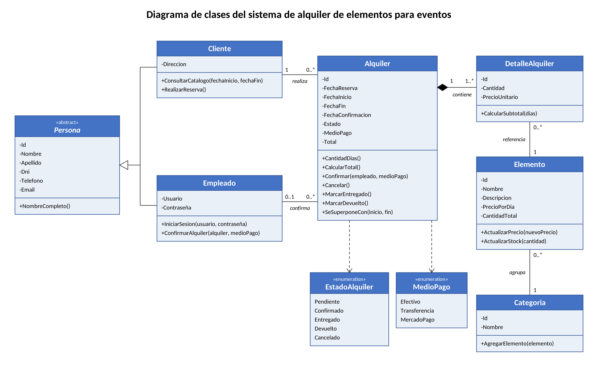

# TP_AlquilerDeEventos_G10

"Sistema de gestión de alquileres de elementos para eventos"

TP\_AlquilerDeEventos\_G10

Sistema de gestión de alquileres de elementos para eventos.

**Integrantes:** Celeste Ball — Jazmín Villa

## Descripción del sistema

Integrantes: [Celeste Ball] - [Jazmín Villa]

Sistema de escritorio para la gestión de un negocio de alquiler de elementos para eventos, como cumpleaños, casamientos o reuniones.

El sistema cuenta con dos tipos de usuario:

- **Cliente:** se identifica, selecciona la fecha de su evento y consulta el catálogo completo, donde cada elemento muestra la cantidad de unidades disponibles para ese día o la indicación "No disponible". A partir de ahí, realiza su reserva eligiendo los elementos y las cantidades que necesita, y se comunica con el negocio por WhatsApp para acordar el pago.
- **Empleado:** gestiona el catálogo (elementos, categorías, precios y stock), confirma las reservas una vez verificado el pago, controla el estado de los alquileres y consulta los reportes.

Antes de registrar una reserva, el sistema verifica que las cantidades solicitadas no superen las unidades disponibles, evitando comprometer más elementos de los que el negocio tiene.

### Entidades principales

| Entidad | Descripción |
|---|---|
| **Persona** | Clase base con los datos comunes de clientes y empleados: nombre, apellido, DNI, teléfono y email. |
| **Cliente** | Persona que alquila elementos para un evento. Además de sus datos personales, registra su dirección. |
| **Empleado** | Persona que trabaja en el negocio. Ingresa al sistema con usuario y contraseña y confirma las reservas. |
| **Categoria** | Agrupa los elementos según su tipo, por ejemplo mesas, sillas o vajilla. |
| **Elemento** | Artículo que el negocio ofrece en alquiler. Tiene un precio por día y una cantidad total de unidades. |
| **Alquiler** | Reserva que realiza un cliente para un rango de fechas. Registra la fecha de la reserva, su estado, el medio de pago, el empleado que la confirmó y el importe total. |
| **DetalleAlquiler** | Cada elemento incluido en un alquiler, con la cantidad de unidades y el precio al momento de alquilar. |

**Estados de un alquiler:** Pendiente → Confirmado → Entregado → Devuelto. En cualquier momento antes de la entrega puede pasar a Cancelado.

---

## Objetivos

- Permitir que los clientes consulten la disponibilidad de los elementos para la fecha de su evento y realicen sus reservas.
- Evitar que se reserven más unidades de las que el negocio tiene disponibles en una fecha determinada.
- Dar al negocio el control sobre la confirmación de las reservas, una vez acordado y verificado el pago.
- Llevar un registro ordenado de clientes, empleados, elementos y alquileres.
- Obtener información útil para la gestión del negocio mediante reportes.

---

## Funcionalidades

### Cliente

| Funcionalidad | Descripción |
|---|---|
| Identificación y registro | Ingresa su DNI; si no está registrado, carga sus datos personales y de contacto. |
| Consulta del catálogo por fecha | Selecciona la fecha de su evento y visualiza todos los elementos con las unidades disponibles o la indicación "No disponible". |
| Alta de reserva | Elige los elementos y las cantidades. La reserva queda Pendiente y las unidades quedan ocupadas, salvo que se cancele. |
| Contacto por WhatsApp | Al registrar la reserva, se abre WhatsApp con un mensaje al negocio con el detalle del alquiler, para coordinar el pago. |

### Empleado

| Funcionalidad | Descripción |
|---|---|
| ABM de Elementos | Alta, baja, modificación y consulta de los elementos del catálogo, con su precio por día y cantidad total. |
| ABM de Categorías | Alta, baja, modificación y consulta de las categorías de elementos. |
| ABM de Clientes | Consulta, modificación y baja de los clientes registrados. |
| Gestión de Alquileres | Confirmar las reservas pendientes una vez verificado el pago, registrar el medio de pago, cancelar reservas y actualizar el estado. |

### Reportes

| N° | Reporte | Descripción |
|---|---|---|
| 1 | Disponibilidad por fecha | Unidades disponibles de cada elemento para una fecha determinada. |
| 2 | Reservas pendientes de confirmación | Reservas en estado Pendiente, con la fecha en que fueron realizadas. |
| 3 | Alquileres entre fechas | Listado de alquileres dentro de un período. |
| 4 | Elementos más alquilados | Ranking de elementos según la cantidad de unidades alquiladas. |
| 5 | Alquileres pendientes de devolución | Alquileres en estado Entregado cuya fecha de fin ya pasó. |

---

## Diagrama de clases

---

## Arquitectura e integración de capas

La solución se divide en dos proyectos:

| Proyecto | Contenido |
|---|---|
| **AlquilerDeEventos.Datos** (Biblioteca de clases) | Los modelos (las clases del diagrama), el contexto de Entity Framework Core (`AlquileresContext`, que representa la conexión con la base de datos) y los repositorios, que guardan y consultan los datos y aplican las reglas del negocio, como la verificación de disponibilidad. |
| **AlquilerDeEventos.UI** (Aplicación WinForms) | Los formularios. Muestran la información, reciben los datos que ingresa el usuario y validan que estén completos y sean correctos. No acceden directamente a la base de datos, sino a través de los repositorios. |

### Ejemplo: cómo se guarda una reserva

1. **Interfaz (WinForms):** el cliente selecciona las fechas, elige los elementos y sus cantidades, y presiona "Reservar". El formulario valida que los campos obligatorios estén completos, que las cantidades sean números mayores a cero y que la fecha de fin no sea anterior a la de inicio.
2. **Interfaz → Biblioteca de clases:** el formulario crea un objeto `Alquiler` con sus `DetalleAlquiler` y se lo envía al repositorio llamando a `AlquilerRepository.Agregar(alquiler)`.
3. **Repositorio:** verifica que haya unidades disponibles de cada elemento para esas fechas. Si no alcanzan, devuelve un error y el formulario se lo muestra al cliente. Si hay disponibilidad, calcula el total y asigna el estado Pendiente.
4. **Contexto (Entity Framework Core):** el repositorio agrega el alquiler al `AlquileresContext` y ejecuta `SaveChanges()`.
5. **Base de datos:** Entity Framework Core traduce la operación a sentencias `INSERT` y guarda el alquiler y sus detalles en las tablas correspondientes.
6. **Respuesta:** el formulario informa que la reserva se registró y abre WhatsApp con el detalle para coordinar el pago.

Cuando el empleado confirma una reserva, el recorrido es el mismo: el formulario llama al repositorio, que ejecuta el método `Confirmar` del alquiler y guarda el cambio con `SaveChanges()`.

---

## Tecnologías

- C# / .NET
- Windows Forms
- Entity Framework Core
- SQL Server
